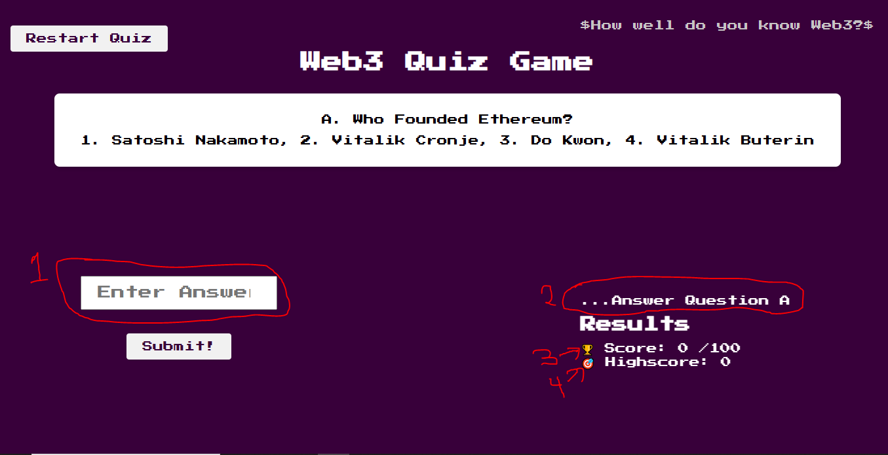

# JavaScript-Crash-Course

<br/>

Welcome to the Beginner-Friendly JavaScript Crash-Course - to set you on a journey from Noob to Web3 Builder!

# Resources For This Course

### Questions

- [Join the Community Discord!](https://discord.gg/pF8sw8CF)
  - Ask questions here and meet with other devs like yourself!

# Table of Contents

<details>
<summary>Resources</summary>
<ol>
<li><a href="#testnet-faucets">Testnet Faucets</a></li>
<li><a href="#resources-for-this-course">Resources For This Course</a><ul>
<li><a href="#questions">Questions</a></li>
</ul>
</li>
<li><a href="#table-of-contents">Table of Contents</a></li>
</ol>
</details>
<details>
<summary> <a href="#module-1-javaScript-basics-and-fundamentals">Module 1: JavaScript Basics and Fundamentals
</a></summary>
<ol>
  <li>
  <a href="#welcome-to-the-course">Welcome to the course! </a>
  </li>
  <li>
  <a href="#best-practices">Best Practices </a>
  </li>
</ol>
</details>

<details>
<summary><a href="#module-2-dom-and-dom-manipulation">Module 2: DOM and DOM Manipulation</a></summary>
<!-- <ol>
<li><a href="#introduction">Introduction</a></li>
<li><a href="#setting-up-your-first-contract">Setting Up Your First Contract</a></li>
<li><a href="#basic-solidity-types">Basic Solidity: Types</a></li>
<li><a href="#basic-solidity-functions">Basic Solidity: Functions</a></li>
<li><a href="#basic-solidity-arrays--structs">Basic Solidity: Arrays &amp; Structs</a></li>
<li><a href="#basic-solidity-compiler-errors-and-warnings">Basic Solidity: Compiler Errors and Warnings</a></li>
<li><a href="#memory-storage-calldata-intro">Memory, Storage, Calldata (Intro)</a></li>
<li><a href="#mappings">Mappings</a></li>
<li><a href="#deploying-your-first-contract">Deploying your First Contract</a></li>
<li><a href="#the-evm--a-recap-of-lesson-2">The EVM &amp; A Recap of Lesson 2</a></li>
</ol> -->
</details>
<details>
<summary><a href="#module-3-understanding-the-basics-of-events-and-event-handling-in-javascript"> Module 3: Understanding the Basics of Events and Event Handling in Javascript</a></summary>
<!-- <ol>
<li><a href="#introduction-1">Introduction</a></li>
<li><a href="#basic-solidity-importing-contracts-into-other-contracts">Basic Solidity: Importing Contracts into other Contracts</a></li>
<li><a href="#basic-solidity-interacting-with-other-contracts">Basic Solidity: Interacting with other Contracts</a></li>
<li><a href="#basic-solidity-inheritance--overrides">Basic Solidity: Inheritance &amp; Overrides</a></li>
<li><a href="#lesson-3-recap">Lesson 3 Recap</a></li>
</ol> -->
</details>
<details>
<summary><a href="#Module-04: Using JavaScript Frameworks and Libraries - EthersJs, React JS, AngularJS">Module 4: Using JavaScript Frameworks and Libraries - EthersJs, React JS, AngularJS</a></summary>
<!-- <ol>
<li><a href="#introduction-2">Introduction</a></li>
<li><a href="#sending-eth-through-a-function--reverts">Sending ETH Through a Function &amp; Reverts</a></li>
<li><a href="#chainlink--oracles">Chainlink &amp; Oracles</a></li>
<li><a href="#review-of-sending-eth-and-working-with-chainlink">Review of Sending ETH and working with Chainlink</a></li>
<li><a href="#interfaces--price-feeds">Interfaces &amp; Price Feeds</a></li>
<li><a href="#importing-from-github--npm">Importing from GitHub &amp; NPM</a></li>
<li><a href="#floating-point-math-in-solidtiy">Floating Point Math in Solidity</a></li>
<li><a href="#basic-solidity-arrays--structs-ii">Basic Solidity: Arrays &amp; Structs II</a></li>
<li><a href="#review-of-interfacs-importing-from-github--math-in-solidity">Review of Interfacs, Importing from GitHub, &amp; Math in Solidity</a></li>
<li><a href="#libraries">Libraries</a></li>
<li><a href="#safemath-overflow-checking-and-the-unchecked-keywork">SafeMath, Overflow Checking, and the &quot;unchecked&quot; keywork</a></li>
<li><a href="#basic-solidity-for-loop">Basic Solidity: For Loop</a></li>
<li><a href="#basic-solidity-resetting-an-array">Basic Solidity: Resetting an Array</a></li>
<li><a href="#sending-eth-from-a-contract">Sending ETH from a Contract</a></li>
<li><a href="#basic-solidity-constructor">Basic Solidity: Constructor</a></li>
<li><a href="#basic-solidity-modifiers">Basic Solidity: Modifiers</a></li>
<li><a href="#testnet-demo">Testnet Demo</a></li>
<li><a href="#advanced-solidity">Advanced Solidity</a><ul>
<li><a href="#immutable--constant">Immutable &amp; Constant</a></li>
<li><a href="#custom-errors">Custom Errors</a></li>
<li><a href="#receive--fallback-functions">Receive &amp; Fallback Functions</a></li>
<li><a href="#lesson-4-recap">Lesson 4 Recap</a></li> -->
</ol>
</details>

<br/>

# Module 1: JavaScript Basics and Fundamentals

Without a doubt, JavaScript is currently the biggest, most popular and most widely used programming language as far as web3 development is concerned.
As a result, a solid understanding of the JavaScript syntax and fundamentals is very important.

In this crash course, we will go over the following:

- Data types in javascript
- Using the _typeof_ operator
- Commenting in Javascript
- How to declare variables in javascript
- The naming convention in Javascript.

## Introduction to Data Types in Javascript

Just like we have alphabets symbols and emoticons in our normal traditional languages EG English Spanish Chinese etc we also have something similar of similar nature in programming languages. They are called Data Types.
Data types are the various ways to represent values in programming.
In JS, there are two major ways in which values are represented:
Primitive values (our focus in this course)
Object values.

When looking at primitive values or primitive data types there are seven(7) major data types. They include:

1. Number
2. Strings
3. Boolean
4. Undefined
5. Null
6. Big Int
7. Symbol

Let's now look into each of these data types.

### Number

The number data type includes integers and float point numbers (ie decimals)

1. Integers: e.g: 10,9,8,7….3,2,1,0,-1,-2,-100, etc
2. Decimals: -10.2, -8.7, -3.66, -0.55, -1.1, etc

### Strings

A string in Javascript is an array of characters represented between double quotes (" ")single quotes (' ') or backticks (``).
E.g:

```
"Ophir Institute"
"Bitcoin to the Moon"
'PineApples'
'Samsung'
`Apple`
`Airplane`
```

### Boolean

A boolean value is either true or false.

e.g:

```
true
false

// Also
const checkValue1 = 10 > 5;
const checkValue2 = 10 < 5;
console.log(checkValue1); // returns true;
console.log(checkValue2); // returns false;
```

### Undefined

As the name implies, a variable is `undefined` in Javascript if we don't assign a value to it.
Another occurrences where is a function does not return a value.

e.g:

```
let birthDate;
console.log(birthDate); // returns undefined
```

### Null

A null data type in JS refers to an empty value.

```
let birthDate = null;
console.log(birthDate);
```

### BigInt

A big int data type is a numeric primitive that can hold and store large integers (i.e. large numeric values) beyond what you can ordinarily store with the `number` data type (i.e `Number.MAX_SAFE_INTEGER`)

```
const checkMaxValue = Number.MAX_SAFE_INTEGER;
console.log(checkMaxValue); // returns 9007199254740991
```

### Symbol

The symbol data type represents primitive values that are unique and immutable.

A symbol data type is created using `Symbol()`.

e.g:

```
const greeting1 = Symbol("Hello World");
const greeting2 = Symbol("Hello World");

console.log(greeting1 === greeting2); // returns false
```

> The above example returns false because even though the values are the same, they are stored uniquely, so they are not the same.

## The Caveat in JS Data Types

It is important to note that unlike what you have in solidity and other statically typed languages, JavaScript has dynamic typing (i.e. it is dynamically typed).

This means that you don't need to declare the type. JavaScript does the type interpretation behind the scenes.

```
// So you can NOT do this:

let Number age = 29;
console.log(age) // This returns a syntax error.
```

## The `typeof` operator

There are times during your coding process where you might want to <u>**check the data type**</u> of a variable in your code.

To do this, you can use the `typeof` operator to check the data type of a certain variable.

Illustration:

```
let birthdate;
const greeting1 = Symbol("Hello World");

console.log(typeof 007); // returns number
console.log(typeof "Ophir"); // returns String
console.log(typeof true); // returns boolean
console.log(typeof birthDate); // returns undefined
console.log(typeof greeting1); //returns symbol
```

## Introduction to Comments in JavaScript

Comments are lines of code that are included in a code for readability. These lines of code are ignored by the compiler/computer engine.

Comments are used in almost every existing programming language out there. However, they are written in different ways across these languages.

In Javascript, there are two ways of writing comments:

- Single-line Comments
- Multi-line Comments

- **Single line comments**: this is declared using two forward slashes (//)

```
E.g:
// This is a comment
```

- **Multi-line Comments**: This is declared with (/\* \*/)

```
/*
This is a multi-line comment
In JS
*/
```

## How to Declare Variables in Javascript

A variable can be likened to a container that holds a certain value.

Variables are used to store data in a computer's memory, so it can be reassessed, reused and modified.

> Take note of these 3 things!

If you need to store a certain value, you declare a variable and store your value in it.

In Javascript, you can declare a variable in three (3) ways using let, const and var.

### Using `let`

This is the flexible way of declaring variables. Variables declared with let can be modified, and reassigned and you can also change the data type.

e.g:

```
let bestMovie = "Fast & Furious";
console.log(bestMovie); // returns Fast & Furious - a string
bestMovie = 300;
console.log(bestMovie); // returns 300 - a number
```

### Using `const`

`const` refers to constant. Values stored in a `const` are immutable (i.e. they cannot be changed).

e.g:

```
const hobbies = "Writing code";
console.log(hobbies);

// You can't then do this
hobbies = "Making money"; // it returns a typeError
```

### Using `var`

This is the old way of defining variables prior to ES6. There are a lot of vulnerabilities surrounding using var to declare variables in JavaScript.

e.g:

```
var favouriteColor = "Purple";
var lastName = "Buterin"

console.log(favouriteColor, lastName);
```

🤔 You may wonder if it has issues why not remove it?

Well, var is preserved for legacy reasons.

A lot of old applications and websites still run with the `var` syntax, hence blocking it out will crash a large portion of websites and apps on the internet.

#### 💡 So which should you use?

As a rule of thumb, always use `const`. However, where you need to reassign a variable, then use `let`. But NEVER use `var`.

> Pretend it doesn't exist!

## Naming Conventions

When it comes to naming variables in Javascript, the universally approved method is to follow the `camelCasing` syntax.

That is, sth like this:

e.g:

```
firstName;
dateOfBirth;
greetingFunction;
createPolicyAgreement;
```

There are some other rules to bear in mind, they include the following:

- Your variable name should never begin with a number
- Do not include special symbols except the dollar sign (\$) and underscore (\_)
- Never use the hyphen (-) to space variable names, and
- Do not include a space between words when naming variables.

```
//dont's

1Name;
2Phone;
first-name;
birth-day-date;
askaquestion?;

```

<br/>

# Module 2: DOM and DOM Manipulation

In this lesson, we’ll address the concept of DOM and DoM manipulation from a theoretical and practical standpoint, so as to lay a solid background for you when we start using JS to interact with web pages.

## Course Overview

In this course, you’ll learn:

- What the DOM is in Javascript.
- What DOM Manipulation means.
- How to Select and manipulate HTML Elements
- How to Select and Manipulate CSS Styles
- How to remove classes from HTML elements
- How to add classes to HTML elements

Without much further ado, let’s dive straight into this

## What does DOM Mean in Javascript?

When we talk about the Document Object Model, we’re referring to a standard representation of HTML documents.

The DOM is a tree-structured representation of an HTML document that gives JS access to all elements, styles and attributes in an HTML document.


> Image Source: W3Schools.com

In essence, the DOM provides developers with a special object ‘document’ which serves as our entry point to select, manipulate, customise and add some interactivity to web pages built with HTML or XML.

Note, however, that the DOM is not a part of JS nor is it a programming language on its own. Instead, the DOM is a programming interface between web pages (or HTML documents) and scripting languages like Javascript/Python, etc.

> You can also work with the DOM in python!

Now, you may ask, _if the DOM is not part o JS, how then does it work with JS?_

Well, the DOM, DOM methods, and its properties is part of web APIs which are inbuilt into most browsers. So, when working with the DOM you may want to run your code directly with your browser’s Javascript engine

**🤔 Why?**

This is because DOM APIs are not an integral part of the NodeJs runtime. So, trying to access the DOM directly in NodeJs will not work. Although, you could get around this with third-party libraries like `jsDoM`, `Cheerio` and `xml2js`, you are not guaranteed optimum performance.

✅ **Solution**: When working with the DOM, it's best to run your code directly on your browser.

> To see a list of all the fundamental data types & interfaces available on the DOM API, check out <u> [this article by mdn](https://developer.mozilla.org/en-US/docs/Web/API/Document_Object_Model/Introduction#fundamental_data_types)</u>

## What does DOM Manipulation mean in Javascript?

Before we delve into a practical illustration of some cool applications of the DOM, let’s set a detailed background to help you really understand what we’ll be doing in the subsequent sub-headings.

Let’s get started 🚀🚀

You’ve probably learnt that HTML, CSS and Javascript are used to build websites where HTML handles the content, CSS handles the presentation and styling of the content and JS is responsible for the connectivity and interactivity of the content.

In order to efficiently carry out its duty, Javascript needs a way to interact with HTML (and its CSS styling) to manipulate the document structure in one way or the other - to achieve some key objectives of the website/app.

In practice, when you build your web page with HTML and CSS, it is usually very static with less interactivity going on, so there’s a need for a way to add some functionality and interaction there.

This is where DOM manipulation comes into play!

So, you can say here that **DOM manipulation** is the process of using the DOM API to manipulate, change, add, remove, or modify elements, attributes and styles in an HTML document.

To help you better understand this concept, we’ll walk through some DOM manipulation techniques and a mini-application for you to play around with.

## How to Select and manipulate HTML Elements/CSS Styles with the DOM

To select HTML elements with the DOM, the `querySelector` method is mostly used. The syntax looks like this:

> P.S: A method is a function built on an object!

```
document.querySelector("HTMLElement/CSS Class ID or Class-Name");
```

E.g. To select the body element of an HTML document, we select it like this:

```
document.querySelector("body");
```

**Selecting CSS class names**

Selecting CSS class names is similar to the HTML selection syntax. The only differnce is the period (".") that is added before the class name when selecting it.

```
document.querySelector(".className");
```

**Selecting CSS Class IDs**

The basic way of selecting CSS class IDs with the DOM is to add a "#" before the ID name.

```
document.querySelector("#headerId");
```

**Selecting CSS class IDs using getElementById**

The alternative way to select CSS class IDs is to use the `getElementById` method.

When we use the `getElementById` method, we can select the same `headerId` in the same way we've been selecting other CSS classes without having to add the "#".

E.g:

```
document.getElementById("headerId");
```

**Selecting all elements using a className**

If you need to select all elements using a particular class name or ID use `querySelectorAll`.

```
document.querySelectorAll(".blocks");
```

**Selecting all elements using a class Id**

You can select this by using the `getElementsByID` method.

## DOM Manipulation in Practice

It's time to practice all you've learnt so far about the DOM manipulation process by working with a simple and very fun application built solely for this course.

The application you will be working with is a minimal "Web3 Quiz Game" where you answer the question displayed on the site and the site responds to your actions on the site, thereby creating a kind of interaction on a simple HTML website.

You can follow along the following part of this course by cloning this Repository: https://github.com/midesofek/Web3-Quiz-Game

> **Please Note:** The HTML/CSS has already been built, we'll only work on the JavaScript aspect to manipulate the web page. Navigate to the `practice-DOM folder` to follow and code along.

If you go through the `index.html` file in your `main-game` or `practice-DOM` folder, you'll have an idea on what this web3 game is doing.

> You can also open the `index.html` file with **Live Server** to test things out.

**PROJECT: SELECT THE HTML ELEMENTS on the Quiz-Game**

Our focus here is to solely **select** the necessary elements in our HTML document,

To do this we'll follow the same syntax explained in the exxamples shared above.



```
document.querySelector(".answer-input");
document.querySelector(".submit-answer");
document.querySelector(".message");
document.querySelector(".score");
document.querySelector(".highscore");
document.querySelector("body");
document.querySelector(".restart-quiz");
document.querySelector(".quiz-container");
```

Now let's store each selection in variables so we can smoothly reuse them later on.

```
const answerInput = document.querySelector(".answer-input");
const inputAnswerBtn = document.querySelector(".submit-answer");
const displayMessage = document.querySelector(".message");
const userScore = document.querySelector(".score");
const userHighScore = document.querySelector(".highscore");
const backgroundColor = document.querySelector("body");
const restartButton = document.querySelector(".restart-quiz");
const containerQuestion = document.querySelector(".quiz-container");
```

And that's all for this module🥳!

In the next module, you'll learn about JS Events, how to handle them and how to collect data from users and respond to events by users.

#WAGMI🚀

<br/>

# Module 3: Understanding the Basics of Events and Event Handling in Javascript

In this lesson, you’ll learn:

- What events mean in Javascript;
- Common examples of events in Javascript;
- What event handling entails in Javascript;
- The difference between events listeners and event handlers; and
- How to respond to user events (clicks && keyboard presses) with Javascript

## What are events in Javascript?

Simply put, events are those things that occur within an application’s environment.

This could be a user click, cursor hover, keyboard press, key hold, page refresh, page scroll, form open, form submission, etc. The list is almost endless as there are lots of ‘things’ that could happen when a user interacts with a website/application.

However, as developers, what is important to us is ‘catching’ and reacting to these events where necessary. And to do this, we attach an **event listener** (or an event handler) to such event.

```
E.g:
document.querySelector("cookButton").addEventListener("click", function(){
    console.log("Hello World");
});

```

## Event Listeners vs Event Handlers

The terms event listeners and event handlers are often used interchangeably, but that doesn’t imply they mean the same thing. There's a difference between an event listener and an event handler.

An **event listener** awaits the trigger of the specified event while the **event handler** is the code implementation that responds to the event occurrence.

## Common Events in Javascript

We get a bunch of these events from user engagements with the content on a website. This is usually referred to as HTML events.

Some of these events include the following:

- onClick
- onKeydown
- onLoad
- onmouseover
- onChange

> You can find a lot more [**here**](https://developer.mozilla.org/en-US/docs/Web/Events)

## Handling Events in JS

In JS, events handlers are used to respond to user actions and to do sth when such event is 'fired' - _the conventional word to use_.

For instance, we may set an event handler (i.e. a code block) to pop open a window alert when a button is clicked.

```
E.g:
document.querySelector("stubbornButton").addEventListener("click", function(){
    window.alert("Welcome to our Site!");
})

```

In this case, what kind of event is triggered here?

Yes that's right, a button click! so the appropriate event to be handled here is the "onclick" event.

Let's now dive into how to respond to user clicks and keyboard presses with JavaScript.
<br/>

## How to respond to User Events - Clicks

To handle event clicks (for instance when a user clicks a button), we use the `addEventListener` method - which is one of the properties of the `document` object.

The `addEventListener` method (recall we said a method is a **function** built on an object) takes in two parameters. The first parameter(param) is the event type, while the second param is a callback function which handles the code logic that is executed when the event is fired.

The syntax:

```
document.querySelector("button").addEventListener("click", function(){
    //Code Logic is written here
    // This function is only called when the event is fired
    // That is why it is called a callback function
})
```

<br/>

## How to respond to User Events - Keyboard Presses

To respond to keyboard press events (i.e. when a user presses some keys on their keyboard), we still have to use the `addEventListener` method. This is because the keyboad press (or key press) is another type of JS event.

**NOTE:** The key press event is a global event so they have to be listened on the whole document. They are called global events because they don't happen on one sinlge element.

The syntax:

```
document.addEventListener("Key-event-type", function(){})
```

In Javascript, there are three(3) major types of keyboard events:

1. keydown (most used) - _is fired as soon as button is clicked_
2. keypress - _is fired continously as long as hand is placed on a button_
3. keyup - _is fired when we lift up our fingers from a key_

Example: Run the code below in your browser console to log into the console the buttons you click on your keyboard

```
document.addEventListener("keydown", function(event){
    console.log(event)';
});
```

<br/>

# Module 4: Using JavaScript Frameworks and Libraries - EthersJs, React JS, AngularJS

As a developer or an aspiring developer, you would work with lots of programming libraries and frameworks (a lot of them!) and possibly build one yourself one day.

But before we arrive at that destination, let's look at programming libraries and frameworks: what they are, their significance and some very popular frameworks you will work with as a web3 developer.

In this lesson, you'll learn:

- The meaning of libraries and frameworks in programming;
- The importance of programming libraries and frameworks; and
- The major distinction between programming libraries and frameworks.

Then you'll also learn the following frameworks, what they are, their importance and why you should use them.

- EthersJs
- ReactJs
- AngularJs

## What are programming libraries?

A programming library is a pile of already-built code that can be used and reused by developers to carry out specific tasks or solve complex coding problems.

For instance, if you were to convert a number to strings in Solidity you would have to write a code like this:

```
E.g:

function numberToString(uint256 number) public pure returns (string memory) {

        if (number == 0) {
            return "0";
        }

        uint256 numDigits;
        uint256 temp = number;

        while (temp != 0) {
            numDigits++;
            temp /= 10;
        }

        bytes memory buffer = new bytes(numDigits);

        while (number != 0) {
            uint256 i = numDigits - 1;
            buffer[i] = bytes1(uint8(48 + (number % 10)));
            numDigits--;
            number /= 10;
        }

        return string(buffer);
    }

```

However, using the "Strings" programming library by Openzeppelin you can implement the same above functionality by simply calling a single function.

E.g:

```
pragma solidity ^0.8.0;

// First import the @OpenZeppelin Strings Library
import "@openzeppelin/contracts/utils/Strings.sol";

contract StringTest{
    using Strings for uint256;

    // The number to string function
    function numToStringWithLibrary(uint256 number) public pure returns(string memory){
        return number.toString(); // Uses the "toString" function in the library to handle the conversion
    }
}

```

Also, with the help of libraries like Openzeppelin, you can deploy fully-fledged NFTs in barely 10 lines of code.

E.g:

```
pragma solidity ^0.8.0;

// Import the openzepplin library for ERC-721 NFTs
import "@openzeppelin/contracts/token/ERC721/ERC721.sol";

// NFTee is  ERC721 signifies that the contract we are creating imports ERC721 and follows ERC721 contract from openzeppelin
contract DemoNFT is ERC721 {

    constructor() ERC721("DemoNFT", "DEMO") {
        // mint an NFT to your wallet upon deployment
        _mint(msg.sender, 1);
    }
}
```

<br/>
  
**How smooth could it get?**
  
That's the importance of working with programming libraries (at least the secure and trusted ones), they make the coding process more efficient and less cumbersome.  
    
Before we move to the next item on our agenda there is also the EthersJs library - a very powerful, complete, and well-packed library for interacting with EVM compatible blockchains.
  
### EthersJs  
  
EthersJs takes away the abstraction so you can send, read, or write messages to the blockchain without having to directly deal with all of the complexity that comes with Ethereum.
  
For instance, we can read the balance of any wallet address on the Polygon blockchain through the EthersJs library.
  
> Note: As a web3 developer, you would work with EthersJs a lot! So you might want to get familiar with the [ <u>EthersJs documentation</u>](https://docs.ethers.org/v5/).

<br/>

## What are Programming Frameworks?

In programming, a framework is a compact tool that provides a developer with a structural layout and necessary tools for building powerful applications.

Unlike libraries, frameworks give developers access to more than _"written codes"_ and _"already solved problems"_.

Some frameworks usually include integration with SDKs (Software Development Kits), application interfaces and other tools that are integral to building secure and efficient web applications.

Let's now take a look at some very popular JavaScript frameworks.

<br/>

## ReactJS

React JS (or React in short) is an open-source front-end JavaScript library used for building user interfaces for any kind of web application.

By its history, React was built and is still maintained by Facebook (now Meta) in 2011 (specifically by a man named Jordan Walke).

React is very powerful and versatile and has grown to become the go-to application for almost every web3 developer out there.

Similar to our clarification earlier (on programming libraries), some believe React is merely a library. But, in actual fact, this is _"wayyyy"_ far from the truth.

There are tons of functionalities inbuilt with React like:

- **Using a virtual DOM:** to efficiently update the UI without even refreshing a page;
- **The JSX syntax:** i.e. JavaScript XML, a mix of HTML and JS;
- **A Declarative Programming Model** - to handle the state of the web page;
- **Server-Side rendering support:** to improve SEO performance.
- **Web3 integration** - react supports a host of web3 functionalities.

Despite all these vast functionalities, React is pretty easy to learn and work with, which is why it is so popular and well-cherished in the web development community.

To help you understand the importance of ReactJs as a powerful JavaScript framework, take a look at big companies that use react to build their web applications:

- Facebook
- Instagram
- WhatsApp
- Netflix
- Dropbox
- Uber
- Reddit
- Shopify
- PayPal
- YahooMail (implemented in 2015!)

_… and a host of others!_

  <br/>

## React & ReactNative

A salient point to note here is that React is used to build web applications/websites while ReactNative (also a part of react) is used to build mobile applications.

<br/>

## AngularJS

Another interesting open-source JavaScript framework to consider is definitely Angularjs.

Angularjs is a structural framework that enables developers to build single-page applications (SPAs) and to bring dynamism to static web pages built with HTML.

A notable feature of angular JS is its ability to enable developers to write clear and concise codes through dynamic binding and dependency injection.

Unlike the previous libraries and frameworks discussed in this lesson, development and updates to the Angularjs framework have been halted since support for the framework was pulled back in January 2022.

> You can read more about it [<u>here</u>](https://docs.angularjs.org/misc/version-support-status)

**🤔 Why?**

The developers of angularjs altered updates on the framework in favour of a more robust version of their well-cherished framework, named **Angular**.

This gives us a clear indication that there is a difference between Angular and Angularjs

<br/>

## The Distinction between Angular and Angularjs

When compared to Angularjs, Angular is much more efficient, structured and fast.

Some of the most obvious limitations of Angularjs is that it is only built in Javascript and only supports JavaScript. It doesn't support mobile browsers, doesn't have a CLI tool and is less manageable compared to Angular.

Angular resolved all these limitations.

Angular is written in typescript and comes with its own CLI tool (very good for DX - developer experience). Also, Angular is supported by all the most popular mobile browsers.

So considering all of these it is safe to conclude that Angular is a better alternative to Angularjs - although you might need some Typescript knowledge to work with it.

<br/>

## **Which should you choose: React vs Angularjs/Angular**

Given the smooth integration React gives to web3 and the large support given to it by the web3 community, React is a better option for web3 frontend development.

So, without beating around the bush, Reactjs should be your go-to option for web3 frontend development.

---
